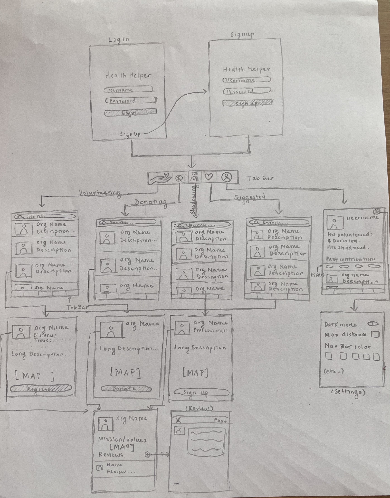
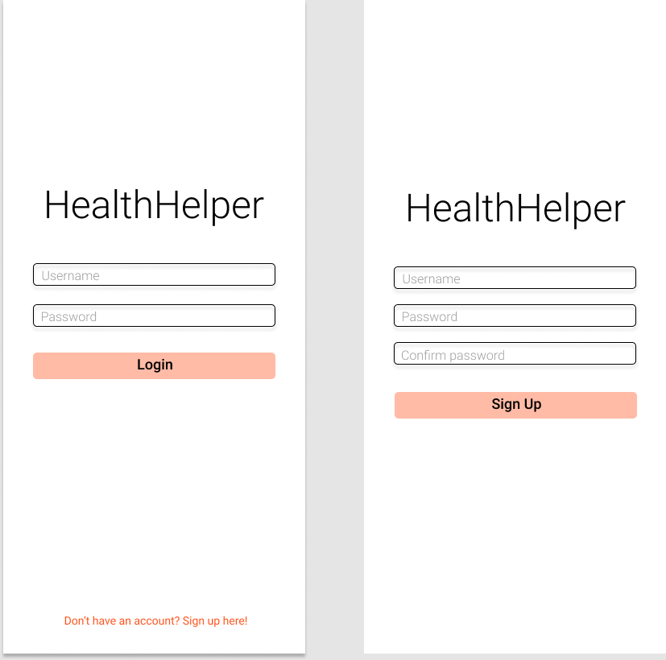
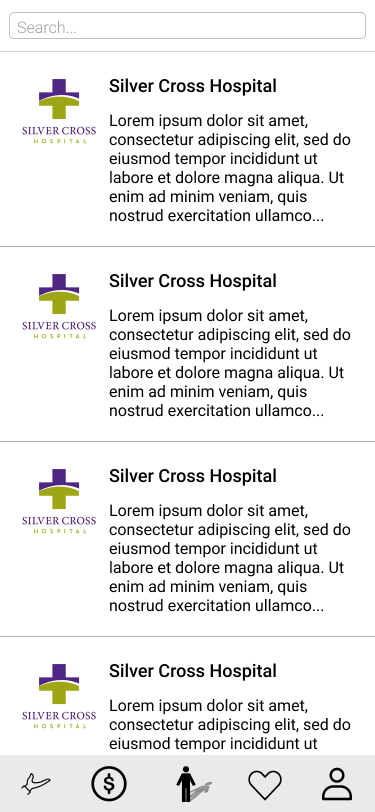

Original App Design Project - README Template
===

# HealthHelper

## Table of Contents
1. [Overview](#Overview)
1. [Product Spec](#Product-Spec)
1. [Wireframes](#Wireframes)
2. [Schema](#Schema)

## Overview
### Description
This is an app that allows users to browse & sign up for volunteer opportunities, specifically targeted towards the field of health and medicine. There is also another tab that allows users to donate to places (hospitals/nursing homes/care centers/etc.) seeking donations. Although these are the basic functionalities, it would also be ideal to have a tab where users (specifically students and aspiring health professionals) can find listings for professionals who are willing to have people shadow them and their work.

### App Evaluation

- **Category:** Lifestyle, Education, or Medical
- **Mobile:** This app will make use of location & maps, giving users the best volunteering suggestions based on places closest to them. Thus, this app lends itself to a mobile platform. Plus, it's very convenient to be able to browse for ways to do good on your phone on the go!
- **Story:** I think this app will be a vital tool for people interested in the health field and those who are looking to improve health in their community. Since this app will ideally combine both the giving/serving and learning sides of the health field, it is a centralized and easy-to-use platform for everyone seeking to learn and serve.
- **Market:** This app can really be used by anyone who wants to make a difference in their community, but it especially appeals to health workers, students, and those who are especially interested in healthcare. This group of people is fairly niche compared to the general population, but it still serves a large and diverse audience within this population. My target audience is for the group mentioned above, but almost anyone could find value in this app.
- **Habit:** This app lends itself to being used over and over again because users will most likely want to volunteer or donate repeatedly to different organizations within their community. Likewise, students looking for learning opportunities will most likely want to look for various opporunities again and again.
- **Scope:** The product I want to build should let users browse and sign up for volunteering opportunities in the health field, donate to organizations within their communities, and search for shadowing opportunities. The goal is to complete all three main features, but I think every one of these features is still interesting on its own, so a stripped-down version of the app would still be good to build.

## Product Spec

### 1. User Stories (Required and Optional)

**Required Must-have Stories**

* A home screen that asks users to sign up or login (linked to a database to store user credentials)
* Screen must have a logout button
* Table view screen listing opporunities close to the user ("close" to be defined later)
* A screen for each opportunity where users can view its details and sign up (either directly on platform or through external link). This screen should include a map that shows the location of the organization. 
* A table view screen listing organizations that a user can make donations to
* A screen for each donation where users can view its details and donate (probably through an external link)
* A table view screen listing shadowing opportunities
* A screen for each shadowing opportunity where users can view its details and sign up
* A search bar so that users can search for specific organizations, tags, etc.
* **Note:** All table views can also be replaced with collection views.

**Optional Nice-to-have Stories**

* A feature and page that tracks amount a user has donated and to where/places a user has volunteered and how long/etc. This just allows for more automatic tracking, so when a user looks back, they can easily see what they have done in the past.
* The above page could also contain a map pinning all locations that a user is currently signed up to volunteer for in the future (a more visual representation for what someone has signed up for).
* An option for a user to choose to search opporunities within ___ miles of their location (I think this is technically optional but would really be the the most fundamental of the nice-to-have stories)
* An option for users to leave reviews of their voluteering experience at a certain organization
* A page that suggests new volunteering/donation/shadowing opporunities based on a user's past signups (this gives us an opportunity to implement a more complex matching algorithm based on tags, keywords, etc.)
* Options to filter opporunties based on tags, location, hours of volunteering, etc.
* Profile screen for each organization (profile picture, description of their mission, link to website, etc.)
* Settings screen (for UI customization or other customization of the fundamental user experience)
* Icons showing if each opportunity is volunteering, donating, or shadowing
* Allow users to follow orgs, have page displaying orgs you've followed

### 2. Screen Archetypes

* Login
   * User should be able to login to the app
* Details
   * Details page for volunteering opportunities, donations, shadowing
* Register
    * User should be able to register for an account, user should be able to sign up for opportunities (this is dependent on whether signups happen internally in the app or through an external link)
* Creation
    * If users want to post reviews
* Profile
    * Profile page for organizations and also for the user (showing their volunteering and donation stats)
* Settings
    * Settings page where users can modify UI, adjust location distance, etc. 
* Maps
    * Maps embedded into details page (showing organization location) and into the user profile page (showing all places they are scheduled to volunteer at)
* Stream
    * Not necessarily a "stream" but a table view listing opporunities/donations

### 3. Navigation

**Tab Navigation** (Tab to Screen)

* Volunteering opportunities
* Donations
* Shadowing opportunities
* Suggested opportunities
* User profile
* Settings

**Flow Navigation** (Screen to Screen)

* Login page
   * Can link to registration page, which then leads back to login page
   * On successful login, bring to volunteering opporunities page
* Volunteering opportunities page
   * Link to details page for each opportunity
       * Details page may link to registration page (or might just contain an external link)
       * Details page may also allow users to click on the organization logo to view the organization profile
* Donations page
   * Link to details page for each donation
       * Details page may also allow users to click on the organization logo to view the organization profile
* Shadowing opportunities page
   * Link to details page for each opportunity
       * Details page may link to registration page (or might just contain an external link)
       * Details page may also allow users to click on the organization logo to view the organization profile
* Suggested opportunities page
   * Link to details page for each opportunity
       * Details page may link to registration page (or might just contain an external link)
       * Details page may also allow users to click on the organization logo to view the organization profile
* User profile page containing their stats
* Organization profile page
    * May contain link to a modal page allowing users to leave a review
* Settings page

## Wireframes
[Add picture of your hand sketched wireframes in this section]


### [BONUS] Digital Wireframes & Mockups

**Login and Signup**



**General Table View**



### [BONUS] Interactive Prototype

## Schema 
### Models
#### User
Property | Type | Description
--- | --- | ---
username |  String | unique username for each user/org 
name |  String | actual name of the org/person 
description |  String | description of org or person
image | File | profile image of user
latitude |  Number | latitude of the org/person location
longitude |  Number | longitude of the org/person location
createdAt |  DateTime | time when user is created (default)
updatedAt |  DateTime | time when user is last updated (default)
totalScore |  Number | sum of all ratings
numReviews | Number | number of ratings
amountDonated | Number | total amount donated via app
volunteerOps | Array | array of volunteering opportunities user has participated in
donations | Array | array of donations user has made
shadowingOps | Array | array of shadowing opportunities user has participated in
reviews | Array | array of reviews user has made

#### Volunteering Opportunity
Property | Type | Description
--- | --- | ---
objectId |  String | unique ID for the opportunity 
author |  Pointer to User | author/org of the opportunity 
description |  String | description of opportunity
createdAt |  DateTime | time when post is created (default)
updatedAt |  DateTime | time when post is last updated (default)
tags |  Array | array of tags/topics associated with the opportunity
url | String | URL to page to sign up
latitude* |  Number | derived from author
longitude* |  Number | derived from author

#### Rating/Review
Property | Type | Description
--- | --- | ---
objectId |  String | unique ID for the review 
author |  Pointer to User | author/org of the review 
comment |  String | comment for the review
stars | Number | star count for the review (out of 5)
createdAt |  DateTime | time when review is created (default)
updatedAt |  DateTime | time when review is last updated (default)

#### Donation
Property | Type | Description
--- | --- | ---
objectId |  String | unique ID for the fundraiser 
author |  Pointer to User | author/org of the fundraiser 
description |  String | description of fundraiser
goalAmount | Number | target amount of money raised
currentAmount | Number | current amount of money raised
createdAt |  DateTime | time when post is created (default)
updatedAt |  DateTime | time when post is last updated (default)
tags |  Array | array of tags/topics associated with the fundraiser
url | String | URL to page to sign up

#### Shadowing Opportunity
Property | Type | Description
--- | --- | ---
objectId |  String | unique ID for the opportunity 
author |  Pointer to User | author/org of the opportunity 
description |  String | description of opportunity
createdAt |  DateTime | time when post is created (default)
updatedAt |  DateTime | time when post is last updated (default)
tags |  Array | array of tags/topics associated with the opportunity
url | String | URL to page to sign up
latitude* |  Number | derived from author
longitude* |  Number | derived from author


### Networking
- Volunteering Opportunities Screen
    - (Read/GET) Query gets all volunteering opportunities (optional filters on screen to user to filter their search)
    ```objectivec
    PFQuery *query = [PFQuery queryWithClassName:@"Volunteering_Ops"];
    [query includeKey:@"author"];
    [query includeKey:@"description"];
    [query includeKey:@"tags"];
    [query includeKey:@"url"];
    query.limit = 20;
    [query orderByDescending:@"createdAt"];
    
    [query findObjectsInBackgroundWithBlock:^(NSArray *posts, NSError *error) {
        if (posts != nil) {
            // do something with the array of object returned by the call
        } else {
            NSLog(@"%@", error.localizedDescription);
        }
    }];
    ```
- Donations Screen
    - (Read/GET) Query gets all donations (optional filters on screen to user to filter their search)
- Shadowing Opportunities Screen
    - (Read/GET) Query gets all shadowing opportunities (optional filters on screen to user to filter their search)
- Suggested Opportunities Screen
    - (Read/GET) Query gets all volunteering opportunities, presented in a sorted order that reflects user's past interests and organizations (optional filters on screen to user to filter their search)
- User Profile Screen
    - (Read/GET) Query gets all user info and displays it (username, stats, reviews, etc.)
    - (Update/PUT) Update user profile image
    ```objectivec
   PFQuery *query = [PFQuery queryWithClassName:@"Users"];
   [query whereKey:@"username" equalTo:[PFUser currentUser].username];
   
   [query findObjectsInBackgroundWithBlock:^(NSArray *users, NSError *error) {
       if (users != nil) {
           // Set user = users[0] 
           // Set user[@"image"] = new image
           // Saving changes to user
           [user saveInBackgroundWithBlock:^(BOOL succeeded, NSError * error) {
               if (succeeded) {
                   // Do something
               } else {
                   NSLog(@"Error: %@", error.localizedDescription);
               }
           }];

       } else {
           NSLog(@"%@", error.localizedDescription);
       }
   }];
    ```
- Organization Profile Screen
    - (Read/GET) Query gets all user info and displays it (username, stats, reviews, etc.)
    - (Delete) Delete existing reviews
    ```objectivec
    PFQuery *query = [PFQuery queryWithClassName:@"Reviews"];
    [query whereKey:@"objectID" equalTo:self.review.objectID];
    [query getFirstObjectInBackgroundWithBlock:^(PFObject *object, NSError *error) {
      if (object) {
            [object deleteInBackground];
      } else {
        NSLog(@"Unable to retrieve object with title %@.", theTitleString);
      }
    }];
    ```
- Login Screen
    - (Read/GET) Authenticate entered info with stored user info
- Sign Up Screen
    - (Create/POST) Create new user account
- Write Review Screen
    - (Create/POST) Post new reviews and ratings for organizations
